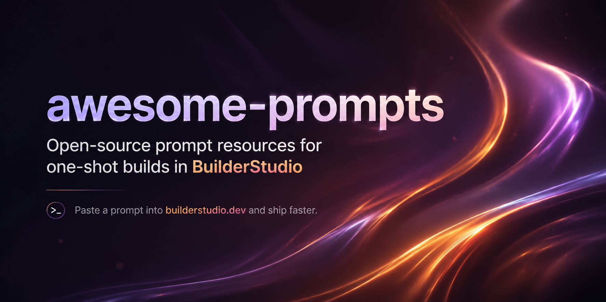

# awesome-prompts



Open-source prompt resources designed to be copied one-shot into **[BuilderStudio](https://builderstudio.dev/)**. BuilderStudio is the primary place where these prompts can be brought to life.

We recommend using GPT 5.3 Codex when using these prompts.

## Why this repo exists

- Keep high-quality prompts open, reusable, and easy to discover.
- Make every prompt easy to copy into BuilderStudio for one-shot generation.
- Organize prompts by category so contributors can submit focused additions through PRs.
- Require a public demo link for every new prompt submitted through a pull request.

## How to use

1. Pick a prompt from the catalog below.
2. Open its `prompt.md` file.
3. Copy the full prompt.
4. Paste it into **[builderstudio.dev](https://builderstudio.dev/)** and run it one-shot.
5. For community-submitted prompts, open the attached demo link to preview what the prompt can create.

## Submission rule

Default seeded prompts in this repository may omit `demo_url`. **Every new prompt added through a pull request must include a valid `demo_url` in `prompt.json`.**

## Catalog (26 prompts)

| Category | Prompt | Summary | BuilderStudio | Demo |
| --- | --- | --- | --- | --- |
| components | [CTA Hero Section](prompts/components/cta-hero-section/prompt.md) | A focused single-page hero section prompt built for React, TypeScript, and Tailwind CSS. | [Open BuilderStudio](https://builderstudio.dev/) | Seed prompt |
| components | [Full Screen Hero](prompts/components/full-screen-hero/prompt.md) | A reusable full-screen hero section prompt using React, Tailwind CSS, Framer Motion, and Lucide React. | [Open BuilderStudio](https://builderstudio.dev/) | Seed prompt |
| components | [Proof Partnerships Section](prompts/components/proof-partnerships-section/prompt.md) | A responsive partnerships and metrics section prompt with staggered word animation and marquees. | [Open BuilderStudio](https://builderstudio.dev/) | Seed prompt |
| creative-studios | [Axion Studio](prompts/creative-studios/axion-studio/prompt.md) | A design agency landing page with shader-driven visuals and a crisp editorial layout. | [Open BuilderStudio](https://builderstudio.dev/) | Seed prompt |
| creative-studios | [DesignPro Landing Page](prompts/creative-studios/designpro-landing/prompt.md) | A modern high-performance landing page prompt for creative product and studio experiences. | [Open BuilderStudio](https://builderstudio.dev/) | Seed prompt |
| creative-studios | [Neue Studio](prompts/creative-studios/neue-studio/prompt.md) | A polished premium studio landing page prompt built with carefully specified typography, media, and layout. | [Open BuilderStudio](https://builderstudio.dev/) | Seed prompt |
| creative-studios | [Prisma Creative Studio](prompts/creative-studios/prisma-creative-studio/prompt.md) | A moody cinematic creative studio landing page prompt with warm cream tones and motion. | [Open BuilderStudio](https://builderstudio.dev/) | Seed prompt |
| effects-and-ui | [Cinematic Video Hero](prompts/effects-and-ui/cinematic-video-hero/prompt.md) | A premium dark hero section prompt centered around a full-screen video experience. | [Open BuilderStudio](https://builderstudio.dev/) | Seed prompt |
| effects-and-ui | [Glass UI Frontend](prompts/effects-and-ui/glass-ui-frontend/prompt.md) | A polished React frontend prompt built around Tailwind CSS v4 and glass-style motion UI. | [Open BuilderStudio](https://builderstudio.dev/) | Seed prompt |
| effects-and-ui | [Liquid Glass Hero](prompts/effects-and-ui/liquid-glass-hero/prompt.md) | A cinematic hero section prompt with looping video and liquid-glass UI elements. | [Open BuilderStudio](https://builderstudio.dev/) | Seed prompt |
| fintech-web3 | [Orbis.Nft](prompts/fintech-web3/orbis-nft/prompt.md) | A dark space-themed NFT landing page prompt with liquid glass treatment and video-driven sections. | [Open BuilderStudio](https://builderstudio.dev/) | Seed prompt |
| fintech-web3 | [RIVR DeFi Dashboard](prompts/fintech-web3/rivr-defi-dashboard/prompt.md) | A glassmorphism DeFi hero prompt for sleek fintech and web3 product presentation. | [Open BuilderStudio](https://builderstudio.dev/) | Seed prompt |
| fintech-web3 | [Rocol Finance Hero](prompts/fintech-web3/rocol-finance-hero/prompt.md) | A polished finance landing page hero prompt inspired by premium abstract visual direction. | [Open BuilderStudio](https://builderstudio.dev/) | Seed prompt |
| portfolio | [3D Creator Portfolio](prompts/portfolio/3d-creator-portfolio/prompt.md) | A one-shot prompt for building a dark 3D creator portfolio for Jack using React, TypeScript, Tailwind CSS, Framer Motion, and Lucide React. | [Open BuilderStudio](https://builderstudio.dev/) | Seed prompt |
| portfolio | [Lexo Hero Section](prompts/portfolio/lexo-hero-section/prompt.md) | A highly accurate responsive React hero prompt for a polished marketing presentation. | [Open BuilderStudio](https://builderstudio.dev/) | Seed prompt |
| portfolio | [Metery Hero Section](prompts/portfolio/metery-hero-section/prompt.md) | A responsive React hero section prompt tuned for exact visual matching and strong presentation. | [Open BuilderStudio](https://builderstudio.dev/) | Seed prompt |
| saas | [Aura Email Client](prompts/saas/aura-email-client/prompt.md) | A premium AI-native email client landing page with cinematic video, glass UI, and polished SaaS presentation. | [Open BuilderStudio](https://builderstudio.dev/) | Seed prompt |
| saas | [Dark Hero Section](prompts/saas/dark-hero-section/prompt.md) | A premium dark-mode hero section prompt with motion, Lucide icons, and strong landing-page structure. | [Open BuilderStudio](https://builderstudio.dev/) | Seed prompt |
| saas | [Loop Hero Section](prompts/saas/loop-hero-section/prompt.md) | A hero section creation prompt suitable for one-shot SaaS and landing page generation. | [Open BuilderStudio](https://builderstudio.dev/) | Seed prompt |
| saas | [Qumica Software Hero](prompts/saas/qumica-software-hero/prompt.md) | A high-performance software company hero section prompt focused on speed, clarity, and conversion. | [Open BuilderStudio](https://builderstudio.dev/) | Seed prompt |
| saas | [SaaS Project Setup](prompts/saas/saas-project-setup/prompt.md) | A structured SaaS project prompt for building a production-quality landing page and app shell. | [Open BuilderStudio](https://builderstudio.dev/) | Seed prompt |
| saas | [Securify Data Security](prompts/saas/securify-data-security/prompt.md) | A full-screen data security SaaS hero section prompt for trust-forward product marketing. | [Open BuilderStudio](https://builderstudio.dev/) | Seed prompt |
| travel-luxury | [Cinematic Space Travel](prompts/travel-luxury/cinematic-space-travel/prompt.md) | A cinematic space-travel landing page prompt for immersive premium web experiences. | [Open BuilderStudio](https://builderstudio.dev/) | Seed prompt |
| travel-luxury | [JetCrest Private Aviation](prompts/travel-luxury/jetcrest-private-aviation/prompt.md) | An ultra-luxury private jet hero section prompt with high-fidelity premium aesthetics. | [Open BuilderStudio](https://builderstudio.dev/) | Seed prompt |
| travel-luxury | [Ratw Hero Section](prompts/travel-luxury/ratw-hero-section/prompt.md) | A highly polished responsive HTML hero section prompt with background video and staged animations. | [Open BuilderStudio](https://builderstudio.dev/) | Seed prompt |
| travel-luxury | [Travel Cinematic Hero](prompts/travel-luxury/travel-cinematic-hero/prompt.md) | A cinematic travel-oriented hero section prompt built as a single responsive HTML experience. | [Open BuilderStudio](https://builderstudio.dev/) | Seed prompt |

## Components

### CTA Hero Section

- Summary: A focused single-page hero section prompt built for React, TypeScript, and Tailwind CSS.
- Prompt file: [prompts/components/cta-hero-section/prompt.md](prompts/components/cta-hero-section/prompt.md)
- BuilderStudio: [builderstudio.dev](https://builderstudio.dev/)
- Demo: seed prompt, no demo URL required
- One-shot usage: Copy the contents of prompt.md and paste it into BuilderStudio for a one-shot run.

### Full Screen Hero

- Summary: A reusable full-screen hero section prompt using React, Tailwind CSS, Framer Motion, and Lucide React.
- Prompt file: [prompts/components/full-screen-hero/prompt.md](prompts/components/full-screen-hero/prompt.md)
- BuilderStudio: [builderstudio.dev](https://builderstudio.dev/)
- Demo: seed prompt, no demo URL required
- One-shot usage: Copy the contents of prompt.md and paste it into BuilderStudio for a one-shot run.

### Proof Partnerships Section

- Summary: A responsive partnerships and metrics section prompt with staggered word animation and marquees.
- Prompt file: [prompts/components/proof-partnerships-section/prompt.md](prompts/components/proof-partnerships-section/prompt.md)
- BuilderStudio: [builderstudio.dev](https://builderstudio.dev/)
- Demo: seed prompt, no demo URL required
- One-shot usage: Copy the contents of prompt.md and paste it into BuilderStudio for a one-shot run.


## Creative Studios

### Axion Studio

- Summary: A design agency landing page with shader-driven visuals and a crisp editorial layout.
- Prompt file: [prompts/creative-studios/axion-studio/prompt.md](prompts/creative-studios/axion-studio/prompt.md)
- BuilderStudio: [builderstudio.dev](https://builderstudio.dev/)
- Demo: seed prompt, no demo URL required
- One-shot usage: Copy the contents of prompt.md and paste it into BuilderStudio for a one-shot run.

### DesignPro Landing Page

- Summary: A modern high-performance landing page prompt for creative product and studio experiences.
- Prompt file: [prompts/creative-studios/designpro-landing/prompt.md](prompts/creative-studios/designpro-landing/prompt.md)
- BuilderStudio: [builderstudio.dev](https://builderstudio.dev/)
- Demo: seed prompt, no demo URL required
- One-shot usage: Copy the contents of prompt.md and paste it into BuilderStudio for a one-shot run.

### Neue Studio

- Summary: A polished premium studio landing page prompt built with carefully specified typography, media, and layout.
- Prompt file: [prompts/creative-studios/neue-studio/prompt.md](prompts/creative-studios/neue-studio/prompt.md)
- BuilderStudio: [builderstudio.dev](https://builderstudio.dev/)
- Demo: seed prompt, no demo URL required
- One-shot usage: Copy the contents of prompt.md and paste it into BuilderStudio for a one-shot run.

### Prisma Creative Studio

- Summary: A moody cinematic creative studio landing page prompt with warm cream tones and motion.
- Prompt file: [prompts/creative-studios/prisma-creative-studio/prompt.md](prompts/creative-studios/prisma-creative-studio/prompt.md)
- BuilderStudio: [builderstudio.dev](https://builderstudio.dev/)
- Demo: seed prompt, no demo URL required
- One-shot usage: Copy the contents of prompt.md and paste it into BuilderStudio for a one-shot run.


## Effects And Ui

### Cinematic Video Hero

- Summary: A premium dark hero section prompt centered around a full-screen video experience.
- Prompt file: [prompts/effects-and-ui/cinematic-video-hero/prompt.md](prompts/effects-and-ui/cinematic-video-hero/prompt.md)
- BuilderStudio: [builderstudio.dev](https://builderstudio.dev/)
- Demo: seed prompt, no demo URL required
- One-shot usage: Copy the contents of prompt.md and paste it into BuilderStudio for a one-shot run.

### Glass UI Frontend

- Summary: A polished React frontend prompt built around Tailwind CSS v4 and glass-style motion UI.
- Prompt file: [prompts/effects-and-ui/glass-ui-frontend/prompt.md](prompts/effects-and-ui/glass-ui-frontend/prompt.md)
- BuilderStudio: [builderstudio.dev](https://builderstudio.dev/)
- Demo: seed prompt, no demo URL required
- One-shot usage: Copy the contents of prompt.md and paste it into BuilderStudio for a one-shot run.

### Liquid Glass Hero

- Summary: A cinematic hero section prompt with looping video and liquid-glass UI elements.
- Prompt file: [prompts/effects-and-ui/liquid-glass-hero/prompt.md](prompts/effects-and-ui/liquid-glass-hero/prompt.md)
- BuilderStudio: [builderstudio.dev](https://builderstudio.dev/)
- Demo: seed prompt, no demo URL required
- One-shot usage: Copy the contents of prompt.md and paste it into BuilderStudio for a one-shot run.


## Fintech Web3

### Orbis.Nft

- Summary: A dark space-themed NFT landing page prompt with liquid glass treatment and video-driven sections.
- Prompt file: [prompts/fintech-web3/orbis-nft/prompt.md](prompts/fintech-web3/orbis-nft/prompt.md)
- BuilderStudio: [builderstudio.dev](https://builderstudio.dev/)
- Demo: seed prompt, no demo URL required
- One-shot usage: Copy the contents of prompt.md and paste it into BuilderStudio for a one-shot run.

### RIVR DeFi Dashboard

- Summary: A glassmorphism DeFi hero prompt for sleek fintech and web3 product presentation.
- Prompt file: [prompts/fintech-web3/rivr-defi-dashboard/prompt.md](prompts/fintech-web3/rivr-defi-dashboard/prompt.md)
- BuilderStudio: [builderstudio.dev](https://builderstudio.dev/)
- Demo: seed prompt, no demo URL required
- One-shot usage: Copy the contents of prompt.md and paste it into BuilderStudio for a one-shot run.

### Rocol Finance Hero

- Summary: A polished finance landing page hero prompt inspired by premium abstract visual direction.
- Prompt file: [prompts/fintech-web3/rocol-finance-hero/prompt.md](prompts/fintech-web3/rocol-finance-hero/prompt.md)
- BuilderStudio: [builderstudio.dev](https://builderstudio.dev/)
- Demo: seed prompt, no demo URL required
- One-shot usage: Copy the contents of prompt.md and paste it into BuilderStudio for a one-shot run.


## Portfolio

### 3D Creator Portfolio

- Summary: A one-shot prompt for building a dark 3D creator portfolio for Jack using React, TypeScript, Tailwind CSS, Framer Motion, and Lucide React.
- Prompt file: [prompts/portfolio/3d-creator-portfolio/prompt.md](prompts/portfolio/3d-creator-portfolio/prompt.md)
- BuilderStudio: [builderstudio.dev](https://builderstudio.dev/)
- Demo: seed prompt, no demo URL required
- One-shot usage: Copy the contents of prompt.md and paste it into BuilderStudio for a one-shot run.

### Lexo Hero Section

- Summary: A highly accurate responsive React hero prompt for a polished marketing presentation.
- Prompt file: [prompts/portfolio/lexo-hero-section/prompt.md](prompts/portfolio/lexo-hero-section/prompt.md)
- BuilderStudio: [builderstudio.dev](https://builderstudio.dev/)
- Demo: seed prompt, no demo URL required
- One-shot usage: Copy the contents of prompt.md and paste it into BuilderStudio for a one-shot run.

### Metery Hero Section

- Summary: A responsive React hero section prompt tuned for exact visual matching and strong presentation.
- Prompt file: [prompts/portfolio/metery-hero-section/prompt.md](prompts/portfolio/metery-hero-section/prompt.md)
- BuilderStudio: [builderstudio.dev](https://builderstudio.dev/)
- Demo: seed prompt, no demo URL required
- One-shot usage: Copy the contents of prompt.md and paste it into BuilderStudio for a one-shot run.


## Saas

### Aura Email Client

- Summary: A premium AI-native email client landing page with cinematic video, glass UI, and polished SaaS presentation.
- Prompt file: [prompts/saas/aura-email-client/prompt.md](prompts/saas/aura-email-client/prompt.md)
- BuilderStudio: [builderstudio.dev](https://builderstudio.dev/)
- Demo: seed prompt, no demo URL required
- One-shot usage: Copy the contents of prompt.md and paste it into BuilderStudio for a one-shot run.

### Dark Hero Section

- Summary: A premium dark-mode hero section prompt with motion, Lucide icons, and strong landing-page structure.
- Prompt file: [prompts/saas/dark-hero-section/prompt.md](prompts/saas/dark-hero-section/prompt.md)
- BuilderStudio: [builderstudio.dev](https://builderstudio.dev/)
- Demo: seed prompt, no demo URL required
- One-shot usage: Copy the contents of prompt.md and paste it into BuilderStudio for a one-shot run.

### Loop Hero Section

- Summary: A hero section creation prompt suitable for one-shot SaaS and landing page generation.
- Prompt file: [prompts/saas/loop-hero-section/prompt.md](prompts/saas/loop-hero-section/prompt.md)
- BuilderStudio: [builderstudio.dev](https://builderstudio.dev/)
- Demo: seed prompt, no demo URL required
- One-shot usage: Copy the contents of prompt.md and paste it into BuilderStudio for a one-shot run.

### Qumica Software Hero

- Summary: A high-performance software company hero section prompt focused on speed, clarity, and conversion.
- Prompt file: [prompts/saas/qumica-software-hero/prompt.md](prompts/saas/qumica-software-hero/prompt.md)
- BuilderStudio: [builderstudio.dev](https://builderstudio.dev/)
- Demo: seed prompt, no demo URL required
- One-shot usage: Copy the contents of prompt.md and paste it into BuilderStudio for a one-shot run.

### SaaS Project Setup

- Summary: A structured SaaS project prompt for building a production-quality landing page and app shell.
- Prompt file: [prompts/saas/saas-project-setup/prompt.md](prompts/saas/saas-project-setup/prompt.md)
- BuilderStudio: [builderstudio.dev](https://builderstudio.dev/)
- Demo: seed prompt, no demo URL required
- One-shot usage: Copy the contents of prompt.md and paste it into BuilderStudio for a one-shot run.

### Securify Data Security

- Summary: A full-screen data security SaaS hero section prompt for trust-forward product marketing.
- Prompt file: [prompts/saas/securify-data-security/prompt.md](prompts/saas/securify-data-security/prompt.md)
- BuilderStudio: [builderstudio.dev](https://builderstudio.dev/)
- Demo: seed prompt, no demo URL required
- One-shot usage: Copy the contents of prompt.md and paste it into BuilderStudio for a one-shot run.


## Travel Luxury

### Cinematic Space Travel

- Summary: A cinematic space-travel landing page prompt for immersive premium web experiences.
- Prompt file: [prompts/travel-luxury/cinematic-space-travel/prompt.md](prompts/travel-luxury/cinematic-space-travel/prompt.md)
- BuilderStudio: [builderstudio.dev](https://builderstudio.dev/)
- Demo: seed prompt, no demo URL required
- One-shot usage: Copy the contents of prompt.md and paste it into BuilderStudio for a one-shot run.

### JetCrest Private Aviation

- Summary: An ultra-luxury private jet hero section prompt with high-fidelity premium aesthetics.
- Prompt file: [prompts/travel-luxury/jetcrest-private-aviation/prompt.md](prompts/travel-luxury/jetcrest-private-aviation/prompt.md)
- BuilderStudio: [builderstudio.dev](https://builderstudio.dev/)
- Demo: seed prompt, no demo URL required
- One-shot usage: Copy the contents of prompt.md and paste it into BuilderStudio for a one-shot run.

### Ratw Hero Section

- Summary: A highly polished responsive HTML hero section prompt with background video and staged animations.
- Prompt file: [prompts/travel-luxury/ratw-hero-section/prompt.md](prompts/travel-luxury/ratw-hero-section/prompt.md)
- BuilderStudio: [builderstudio.dev](https://builderstudio.dev/)
- Demo: seed prompt, no demo URL required
- One-shot usage: Copy the contents of prompt.md and paste it into BuilderStudio for a one-shot run.

### Travel Cinematic Hero

- Summary: A cinematic travel-oriented hero section prompt built as a single responsive HTML experience.
- Prompt file: [prompts/travel-luxury/travel-cinematic-hero/prompt.md](prompts/travel-luxury/travel-cinematic-hero/prompt.md)
- BuilderStudio: [builderstudio.dev](https://builderstudio.dev/)
- Demo: seed prompt, no demo URL required
- One-shot usage: Copy the contents of prompt.md and paste it into BuilderStudio for a one-shot run.


## Contributing

Add a new prompt under `prompts/<category>/<slug>/` with both `prompt.md` and `prompt.json`. New prompt PRs must include `demo_url`.

```bash
npm run validate
npm run generate:readme
npm run validate:pr
```

